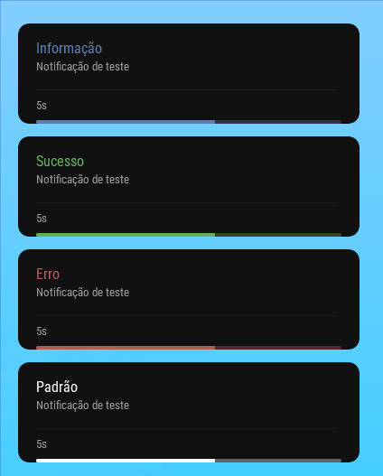
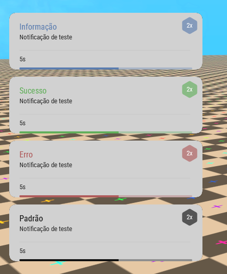

Download: https://github.com/VzScripter/notification-v1/releases

# 📧 Sistema de Notificação

- Um sistema simples para e efetivo para criar notificações aos jogadores
- Você pode criar temas personalizados para a notificação e os jogadores podem alterar com o comando /tema e testar com /teste




# Funções Exportáveis:

### Função "add"
Essa função irá adicionar uma notificação na tela de um jogador específico.

## Server
```lua
exports['notification-v1']:add(element, message, type, [time, priority, tickSended])
```
## Client
```lua
exports['notification-v1']:add(message, type, [time, priority, tickSended])
```

### Função "addToAllPlayers"
Essa função irá adicionar uma notificação na tela de todos os jogadores do servidor (Recomendado usar pois sincroniza a notificação com todos os jogadores, tanto antes quanto depois de entrar no server).

## Server
```lua
exports['notification-v1']:addToAllPlayers(message, type, [time])
```

# Créditos

Código: `vzscr`

Design: `araujox7`

Caso tenha algum erro, considere reportar (com prints de preferência) na aba [Issues](https://github.com/VzScripter/notification-v1/issues/new), aceito sugestões para melhorar meu código. Obrigado a todos!
